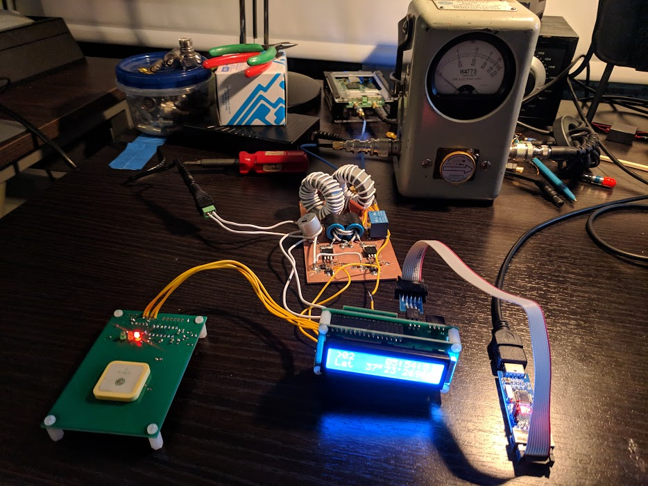

# Making 2-way JT9 QSOs with a QRP Labs U3S



The heart of my apartment 630m "QRP" station is a [U3S Transmitter](https://www.qrp-labs.com/ultimate3/u3s.html) from QRP Labs. This kit transmitter is designed to be used as a QRP/QRSS beacon, rather than making QSOs. It works well as a WSPR beacon, but there's only so much fun to be had WSPRing.

The U3S has limited support for transmitting JT9 messages. The U3S can be configured with a 13-character "freeform" JT9 message, as well as a transmission schedule (how many minutes between "frames" and what minute of the hour to begin transmitting). Generally programming of the U3S is done awkwardly through various menus and a pair of momentary pushbuttons. This is fine for beacon use, but not practical for QSOs.

So to make QSO-mode operation possible, I've devised a hacky scheme to change the JT9 messages and transmit interval (selecting the "even" or "odd" minute for transmission) from my computer commandline. It has three parts.

- Reading and writing U3S EEPROM (which contains the U3S settings)
- Using the u3s-eeprom-tool to modify the EEPROM content with desired settings
- A simple shell script to automate the process

## Reading and writing the U3S EEPROM with avrdude
The U3S has an optional 6-pin programming header which interfaces to a standard 6-pin Atmel ISP programmer. This header must be populated and a 100K pull-up installed at R3, per the U3S assembly instructions.

Programming is accomplished with avrdude, an open-source programming utility for Atmel AVR micros (such as the ATmega328P used in the U3S) and a supported programming cable. The USBasp style cable is [available cheaply](https://www.amazon.com/HiLetgo-ATMEGA8-Programmer-USBasp-Cable/dp/B00AX4WQ00) from various online sources. A [10-pin to 6-pin adapter](https://www.amazon.com/Sunkee-Standard-Adapter-AVRISP-USBASP/dp/B00CW80MP6) is also helpful, depending on the pinout of the chosen programmer.

U3S configuration data is stored in the first 256 bytes of the EEPROM in the ATmega328P microcontroller. Using the open source [avrdude](https://www.nongnu.org/avrdude/) software, the EEPROM may be read into an Intel Hex-format file as shown below.


```
$ avrdude -c usbasp -p m328p -U eeprom:r:u3s-ex.hex:i

avrdude: warning: cannot set sck period. please check for usbasp firmware update.
avrdude: AVR device initialized and ready to accept instructions

Reading | ################################################## | 100% 0.00s

avrdude: Device signature = 0x1e950f (probably m328p)
avrdude: reading eeprom memory:

Reading | ################################################## | 100% 0.78s

avrdude: writing output file "u3s-ex.hex"

avrdude: safemode: Fuses OK (E:FC, H:D1, L:F7)

avrdude done.  Thank you.
```

The content of the file `u3s-ex.hex` from the above example is shown below.

```
:20000000000000001ECD5B87434D3837574A004E3156460000000000000000000000EA036B
:20002000000000AA1E00010000008A000014344207000000000000000000000000000000DC
:200040000000000000000000000000000000000000000000000000000000000000000000A0
:20006000000000000000000000000000000000000000000000000000000000000000000080
:20008000000000000000000000000000000000000000000000000000000000000000000060
:2000A00000000000000000000000600C9C01002D3101660000000000000004000000005E10
:2000C000D0B2C8000000000000000A000000282300005A0000000000000000000000000027
:2000E000000000000000000000000000000000000000000000000000000000000000000000
:200100000000000000000000000000000000000000000000000000000000000000000000DF
:200120000000000000000000000000000000000000000000000000000000000000000000BF
:2001400000000000000000000000000000000000000000000000000000000000000000009F
:2001600000000000000000000000000000000000000000000000000000000000000000007F
:2001800000000000000000000000000000000000000000000000000000000000000000005F
:2001A00000000000000000000000000000000000000000000000000000000000000000003F
:2001C00000000000000000000000000000000000000000000000000000000000000000001F
:2001E0000000000000000000000000000000000000000000000000000000000000000000FF
:200200000000000000000000000000000000000000000000000000000000000000000000DE
:200220000000000000000000000000000000000000000000000000000000000000000000BE
:2002400000000000000000000000000000000000000000000000000000000000000000009E
:2002600000000000000000000000000000000000000000000000000000000000000000007E
:2002800000000000000000000000000000000000000000000000000000000000000000005E
:2002A00000000000000000000000000000000000000000000000000000000000000000003E
:2002C00000000000000000000000000000000000000000000000000000000000000000001E
:2002E0000000000000000000000000000000000000000000000000000000000000000000FE
:200300000000000000000000000000000000000000000000000000000000000000000000DD
:200320000000000000000000000000000000000000000000000000000000000000000000BD
:2003400000000000000000000000000000000000000000000000000000000000000000009D
:2003600000000000000000000000000000000000000000000000000000000000000000007D
:2003800000000000000000000000000000000000000000000000000000000000000000005D
:2003A00000000000000000000000000000000000000000000000000000000000000000003D
:2003C00000000000000000000000000000000000000000000000000000000000000000001D
:2003E0000000000000000000000000000000000000000000000000000000000000000000FD
:00000001FF
```

## Modifying the U3S EEPROM image

## Scripting it up!

The script below ties it all together.

```bash
#!/bin/sh

# make a copy of an existing "base" image
cp u3s.hex jt9-tmp.hex

# modify the transmission, message and frame fields
./u3s-eeprom-tool edit jt9-tmp.hex transmissions[0].mode "JT91"
./u3s-eeprom-tool edit jt9-tmp.hex transmissions[0].enabled true
./u3s-eeprom-tool edit jt9-tmp.hex transmissions[0].frequency 475200
./u3s-eeprom-tool edit jt9-tmp.hex transmissions[0].powerOrMessageIndex 0
./u3s-eeprom-tool edit jt9-tmp.hex message "$2"
./u3s-eeprom-tool edit jt9-tmp.hex frame.frame 2
./u3s-eeprom-tool edit jt9-tmp.hex frame.start $1

# cut off the last 768 bytes of the image (unused), to save programming time
cat jt9-tmp.hex | grep -v :200[123] > jt9-tmp-trunc.hex

# program it! (and reboot the U3S)
avrdude -c usbasp -p m328p -U eeprom:w:jt9-tmp-trunc.hex
```
